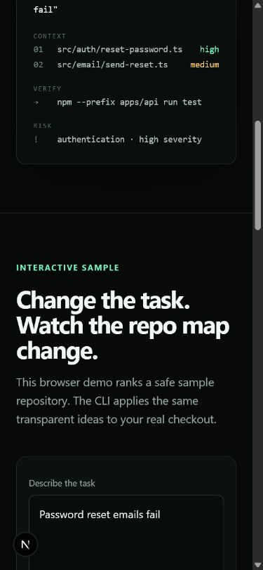

<div align="center">

# FixMap

**Give your coding agent a map before it starts editing.**

Turn an issue or git diff into relevant files, test routes, risk notes, and an honest review receipt.

[](https://github.com/aryamthecodebreaker/FixMap/actions/workflows/ci.yml)
[](https://www.npmjs.com/package/@aryam/fixmap)
[](LICENSE)

[Live demo](https://fixmap-flax.vercel.app) · [Install](#quick-start) · [MCP server](#mcp-server) · [GitHub Action](#github-action) · [Contribute](CONTRIBUTING.md)

</div>



## Why FixMap?

Coding agents are fast once they have the right context. The expensive mistakes happen earlier:

- reading a plausible file instead of the owning module
- missing the test that would catch the regression
- treating an unresolved git diff as “no changes”
- leaving reviewers to guess what was actually verified

FixMap is a transparent routing layer for that gap. It works locally, needs no account or API key, and does not send repository source to a third-party service.

## Quick start

Run from a JavaScript or TypeScript repository:

```bash
npx @aryam/fixmap plan --issue "password reset emails fail"
```

Use a real branch diff:

```bash
npx @aryam/fixmap plan --diff main...HEAD
```

Machine-readable output:

```bash
npx @aryam/fixmap plan --base main --head HEAD --format json --output fixmap-report.json
```

Example result:

```text
## Context Files
- src/auth/reset-password.ts (high confidence): path and content match
- src/email/send-reset.ts (medium confidence): content match

## Test Route
- npm --prefix apps/api run test

## Risk Map
- high authentication: authentication-related files are affected
```

## MCP server

FixMap ships as a Model Context Protocol server, so coding agents can request a plan themselves instead of you pasting reports around. One tool is exposed: `fixmap_plan`.

Claude Code:

```bash
claude mcp add fixmap -- npx -y @aryam/fixmap mcp
```

Cursor, Windsurf, or any MCP client:

```json
{
  "mcpServers": {
    "fixmap": {
      "command": "npx",
      "args": ["-y", "@aryam/fixmap", "mcp"]
    }
  }
}
```

The agent calls `fixmap_plan` with an issue description or a diff spec (`main...HEAD`) and receives the same report as the CLI: context files with confidence and reasons, test routes, risk notes, and diagnostics. Everything runs locally over stdio; no repository content leaves the machine.

## Interactive demo

The [live website](https://fixmap-flax.vercel.app) includes a browser-only sample repository: change the task and watch the context pack update. It is deliberately labeled as a sample; the CLI scans real local repositories.

Run the site locally:

```bash
npm ci
npm run dev -w @fixmap/web
```

## GitHub Action

Add FixMap to pull requests with a versioned release:

```yaml
name: FixMap

on:
  pull_request:

permissions:
  contents: read
  issues: write
  pull-requests: write

jobs:
  fixmap:
    runs-on: ubuntu-latest
    steps:
      - uses: actions/checkout@v7
        with:
          fetch-depth: 0
      - id: fixmap
        uses: aryamthecodebreaker/FixMap/packages/action@v0.3.1
        with:
          github-token: ${{ secrets.GITHUB_TOKEN }}
```

Pin the Action to the latest [release tag](https://github.com/aryamthecodebreaker/FixMap/releases); a floating `v1` major tag is planned after wider acceptance testing. The Action upserts one marked PR comment, writes Markdown to the step summary, and exposes `report`, `context-count`, and `test-route-count` outputs. On forked pull requests, GitHub may restrict comment permissions; the step summary still contains the report.

## What it uses

The ranker is deterministic and inspectable:

- task and identifier overlap in paths and file samples
- real changed files from a resolved git diff, including untracked files in working-tree diffs
- `.gitignore`-aware scanning, so generated output does not outrank source
- code, test, documentation, and configuration classification
- nearby paths and workspace package boundaries
- npm, pnpm, Yarn, and Bun script routing
- explicit confidence and diagnostic messages

It intentionally does **not** claim correctness, execute suggested commands, or hide failed diff resolution.

## Evaluation

Ranking changes must pass a checked-in task-to-file evaluation gate in addition to unit tests:

```bash
npm run evaluate
```

The current suite covers Action failures, invalid diffs, authentication, the web demo, workspace test routing, and contributor documentation. The cases and full ranked results are visible in [`benchmarks/`](benchmarks); broader cross-repository evaluation is tracked on the roadmap rather than presented as finished work.

## Repository layout

```text
packages/core     scanner, ranking, routing, reports
packages/cli      npx/CLI entry point and MCP server
packages/action   bundled GitHub Action
apps/web          interactive Next.js product site
benchmarks        transparent ranking evaluation cases
examples          inspectable sample input and output
```

## Development

Requires Node.js 20.11 or newer.

```bash
npm ci
npm run ci
```

`npm run ci` runs the complete test suite, typechecking, ESLint, production builds, Action bundle drift verification, CLI/Action smoke checks, and the ranking evaluation gate.

## Status and roadmap

FixMap is an early public release focused on JavaScript and TypeScript repositories. The [changelog](CHANGELOG.md) records what each released version shipped, most recently the MCP server mode and scanner/ranking fixes in v0.3.x. Near-term work:

- import/dependency graph proximity
- git co-change and ownership signals
- adapters and examples for popular monorepo layouts
- a larger, reproducible cross-repository evaluation dataset
- stable `v1` Action tag after wider acceptance testing

See [open issues](https://github.com/aryamthecodebreaker/FixMap/issues) for scoped work. Contributions are welcome.

## License

MIT © FixMap contributors.
