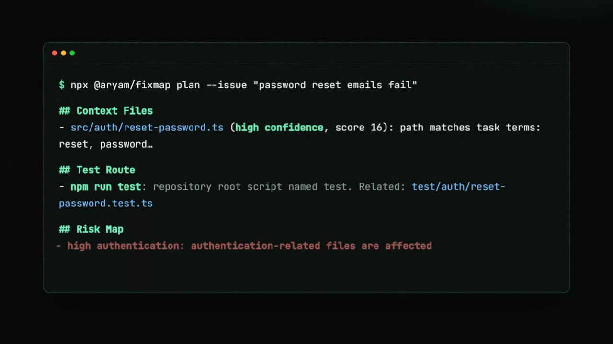

<div align="center">

# FixMap

### Know where to edit before the first edit.

Paste a GitHub issue URL, describe a task, or point at a diff. FixMap returns ranked context files, test routes, risk notes, and explainable diagnostics—without an account, API key, or model call.

[](https://github.com/aryamthecodebreaker/FixMap/actions/workflows/ci.yml)
[](https://www.npmjs.com/package/@aryam/fixmap)
[](https://github.com/aryamthecodebreaker/FixMap/releases/latest)
[](https://github.com/marketplace/actions/fixmap)
[](LICENSE)

[Try one command](#one-command-start) · [Watch the 24-second film](https://fixmap-flax.vercel.app/#launch-film) · [Install the Action](https://github.com/marketplace/actions/fixmap) · [Connect MCP](#mcp-server) · [Contribute](CONTRIBUTING.md)

</div>

## One-command start

Give FixMap a public GitHub issue. It fetches the task, infers the repository, scans an isolated temporary checkout, and removes that checkout when the report is complete:

```bash
npx -y @aryam/fixmap@latest plan --issue https://github.com/aryamthecodebreaker/FixMap/issues/59
```

No clone, signup, configuration, or source upload is required.

<!-- Reproducible recording: regenerate with `npm run build:cli && node scripts/render-demo.mjs` -->


## The problem FixMap solves

Coding agents are fast after they find the right context. The expensive mistakes happen before the first edit:

- opening a plausible file instead of the definition that owns the behavior
- missing the nearest test or workspace-specific test command
- treating an unresolved diff as “no changes”
- reviewing a change without an explicit map of affected code and risks

FixMap adds a deterministic routing step before an agent starts searching. Its output is evidence, not a correctness claim:

| Output | What it tells you |
| --- | --- |
| Ranked context files | Where to start, with confidence and inspectable reasons |
| Test routes | Which package command and related tests are likely to verify the change |
| Risk map | Which sensitive areas are touched and why |
| Diagnostics | Missing refs, scan limits, remote-fetch details, and other uncertainty |
| Markdown or JSON | A human handoff or machine-readable input for the next tool |

## Use FixMap your way

### CLI

Analyze a task against any public GitHub repository:

```bash
npx -y @aryam/fixmap@latest plan \
  --issue "support public GitHub issue URLs" \
  --repo https://github.com/aryamthecodebreaker/FixMap
```

Analyze private source or working-tree changes locally:

```bash
npx -y @aryam/fixmap@latest plan --issue "password reset emails fail"
npx -y @aryam/fixmap@latest plan --diff main...HEAD
```

Write machine-readable output:

```bash
npx -y @aryam/fixmap@latest plan \
  --base main \
  --head HEAD \
  --format json \
  --output fixmap-report.json
```

Remote repository mode is issue-only. Clone the repository locally when you need `--diff`, `--base`, or `--head`.

### MCP server

FixMap exposes one stdio tool, `fixmap_plan`, so an agent can request the same report directly.

Claude Code:

```bash
claude mcp add fixmap -- npx -y @aryam/fixmap@latest mcp
```

Cursor, Windsurf, or another MCP client:

```json
{
  "mcpServers": {
    "fixmap": {
      "command": "npx",
      "args": ["-y", "@aryam/fixmap@latest", "mcp"]
    }
  }
}
```

The official MCP Registry identifier is `io.github.aryamthecodebreaker/fixmap`. Analysis runs locally over stdio; FixMap does not send repository source to a hosted model or service.

### GitHub Action

Install [FixMap from GitHub Marketplace](https://github.com/marketplace/actions/fixmap), or add the versioned Action directly:

```yaml
name: FixMap

on:
  pull_request:

permissions:
  contents: read
  issues: write
  pull-requests: write

jobs:
  fixmap:
    runs-on: ubuntu-latest
    steps:
      - uses: actions/checkout@v7
        with:
          fetch-depth: 0
      - id: fixmap
        uses: aryamthecodebreaker/FixMap@v0.7.0
        with:
          github-token: ${{ secrets.GITHUB_TOKEN }}
```

The Action upserts one marked pull-request comment, writes the complete report to the step summary, and exposes `report`, `context-count`, and `test-route-count` outputs. Pin a [release tag](https://github.com/aryamthecodebreaker/FixMap/releases); a floating `v1` tag will follow wider acceptance testing.

On forked pull requests, GitHub supplies a read-only token. FixMap warns instead of failing and keeps the full report in the step summary and outputs. Do not switch to `pull_request_target` while checking out untrusted fork code just to restore comments.

## Why trust the output?

FixMap is deliberately inspectable:

- **Deterministic:** the same task, repository, and diff produce the same ranking—there is no hidden model call.
- **Explainable:** every ranked file includes reasons such as path matches, content matches, exact definitions, changed-file evidence, or import proximity.
- **Local-first:** local repositories stay local; public URLs use an anonymous temporary checkout.
- **Non-executing:** FixMap never installs dependencies or runs repository build, test, hook, or package scripts.
- **Git-aware:** scans respect `.gitignore`, include untracked files in working-tree diffs, and surface unresolved refs as errors.
- **Monorepo-aware:** test routing understands npm, pnpm, Yarn, Bun, and workspace package boundaries.
- **Bounded:** file counts, text samples, issue bodies, network responses, and remote-fetch time are capped with explicit diagnostics.

Public repository inputs accept only canonical credential-free `https://github.com/owner/repository` URLs. FixMap disables credential helpers, inherited Git configuration, hooks, submodules, symlinks, and LFS smudging, then removes the checkout on success or failure. Public issue fetching uses GitHub’s fixed API host without credentials or redirects.

## Evidence, not hype

Ranking changes must pass both the internal evaluation gate and a frozen cross-repository evaluation built from six real, already-fixed issues in permissively licensed projects.

| v0.7.0 external evaluation | Result |
| --- | ---: |
| Expected fixing file ranked Top-1 | 4 / 6 (67%) |
| Expected fixing file ranked Top-3 | 6 / 6 (100%) |
| Expected fixing file ranked Top-5 | 6 / 6 (100%) |

The dataset covers Express, Axios, debug, ky, Zod, and Pino at exact commits. Every input and ranked output is checked into [`benchmarks/external/`](benchmarks/external), and a scheduled workflow reruns it weekly. Six cases are useful regression evidence—not a general accuracy claim.

The v0.7.0 release also passed 122 automated tests, typechecking, linting, production builds, package and Action smoke tests, the internal evaluation gate, the frozen external evaluation, a production dependency audit gate, and a deterministic 1,000-file scanner check.

Read the full [benchmark methodology and scanner measurements](docs/BENCHMARKS.md).

## What changed in v0.7.0

FixMap now recognizes distinctive identifiers and exact code or literal fragments in task text, then boosts the nearby definition site instead of merely rewarding repeated words. That moved the frozen Zod #5944 fixing file from outside the Top-5 to Top-1 while keeping the dataset unchanged.

[Read the v0.7.0 release notes](https://github.com/aryamthecodebreaker/FixMap/releases/tag/v0.7.0) · [Inspect the changelog](CHANGELOG.md) · [See every external ranking](benchmarks/external/README.md)

## Watch it work

[](https://fixmap-flax.vercel.app/#launch-film)

[Play the launch film](https://fixmap-flax.vercel.app/fixmap-launch.mp4) · [Explore the browser demo](https://fixmap-flax.vercel.app/#demo) · [Open the repository](https://github.com/aryamthecodebreaker/FixMap)

The website demo runs against a small browser-only sample. The CLI, MCP server, and Action scan real repositories.

## How ranking works

FixMap combines bounded, visible signals rather than one opaque score:

1. Normalize the issue, task text, repository input, and optional git diff.
2. Scan code, tests, documentation, and configuration while respecting ignore rules.
3. Rank path/content overlap, distinctive definition sites, changed files, import-graph proximity, nearby paths, and workspace ownership.
4. Route the closest package-level test command and related test files.
5. Report risk areas and diagnostics without executing the suggested commands.

The implementation lives in [`packages/core`](packages/core), shared by every interface.

## Repository layout

```text
packages/core     scanner, ranking, routing, reports
packages/cli      npx/CLI entry point and MCP server
packages/action   bundled GitHub Action
apps/web          interactive Next.js product site
benchmarks        transparent ranking evaluation cases
examples          inspectable sample input and output
```

## Develop locally

FixMap requires Node.js 20.11 or newer.

```bash
npm ci
npm run ci
```

`npm run ci` covers typechecking, tests, a high/critical production audit gate, linting, production builds, Action and MCP metadata, bundle drift, smoke tests, evaluations, and scanner correctness. Use `npm run benchmark:scan` for the non-gating performance benchmark.

## Current scope

FixMap is focused on JavaScript and TypeScript repositories. It does not claim that a ranked file is correct, execute suggested commands, or hide failed diff resolution.

Next priorities include:

- expanding the frozen cross-repository dataset beyond six cases
- adding co-change and ownership signals
- publishing more monorepo adapters and examples
- promoting a stable `v1` Action tag after wider acceptance testing

See [open issues](https://github.com/aryamthecodebreaker/FixMap/issues) for scoped work, or start with [CONTRIBUTING.md](CONTRIBUTING.md). Security reports belong in the process described by [SECURITY.md](SECURITY.md).

## License

MIT © FixMap contributors.
