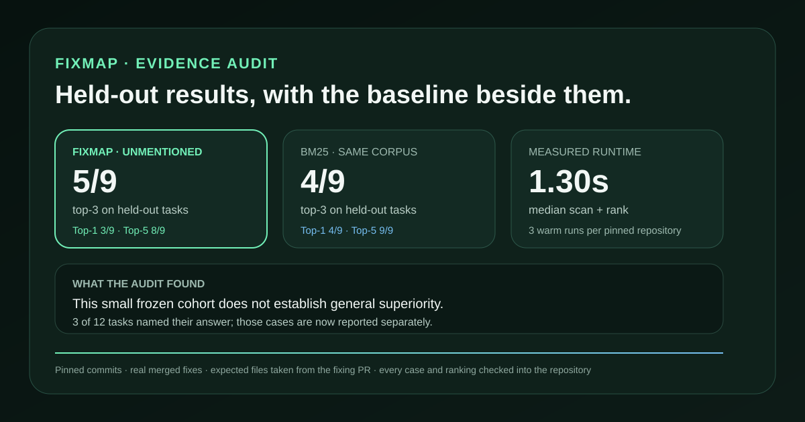

<div align="center">

# FixMap

### Know where to edit before the first edit.

Paste a GitHub issue URL, describe a task, or point at a diff. FixMap returns ranked context files, test routes, risk notes, and explainable diagnostics—without an account, API key, or model call.

[](https://github.com/aryamthecodebreaker/FixMap/actions/workflows/ci.yml)
[](https://www.npmjs.com/package/@aryam/fixmap)
[](https://github.com/aryamthecodebreaker/FixMap/releases/latest)
[](https://github.com/marketplace/actions/fixmap)
[](LICENSE)

[Try one command](#one-command-start) · [Watch the 24-second film](https://fixmap-flax.vercel.app/#launch-film) · [Install the Action](https://github.com/marketplace/actions/fixmap) · [Connect MCP](#mcp-server) · [Contribute](CONTRIBUTING.md)

</div>

## One-command start

Give FixMap a public GitHub issue. It fetches the task, infers the repository, scans an isolated temporary checkout, and removes that checkout when the report is complete:

```bash
npx -y @aryam/fixmap@latest plan --issue https://github.com/aryamthecodebreaker/FixMap/issues/59
```

No clone, signup, configuration, or source upload is required.

If an older FixMap is installed globally, some npm/npx combinations on Windows can resolve the old global `fixmap` shim even when a package version is pinned. Remove it with `npm uninstall -g @aryam/fixmap`, or use the unambiguous form:

```bash
npm exec --yes --package=@aryam/fixmap@0.7.4 -- fixmap --version
```

| Command | Answers |
| --- | --- |
| [`fixmap plan`](#cli) | Which files, tests, and risks should I look at first? |
| [`fixmap plan --explain <path>`](#ask-why) | Why is the file I expected *not* in that list? |
| [`fixmap verify`](#verify-the-change-afterwards) | Did the change I made match the plan? |
| [`fixmap mcp`](#mcp-server) | The same report, requested directly by an agent |

The CLI points at the next useful command as you go, so `--explain` and `verify` surface when they apply rather than only living here.

<!-- Reproducible recording: regenerate with `npm run build:cli && node scripts/render-demo.mjs` -->


## The problem FixMap solves

Coding agents are fast after they find the right context. The expensive mistakes happen before the first edit:

- opening a plausible file instead of the definition that owns the behavior
- missing the nearest test or workspace-specific test command
- treating an unresolved diff as “no changes”
- reviewing a change without an explicit map of affected code and risks

FixMap adds a deterministic routing step before an agent starts searching. Its output is evidence, not a correctness claim:

| Output | What it tells you |
| --- | --- |
| Ranked context files | Where to start, with confidence and inspectable reasons |
| Test routes | Which package command and related tests are likely to verify the change |
| Risk map | Which sensitive areas are touched and why |
| Diagnostics | Missing refs, scan limits, remote-fetch details, and other uncertainty |
| Markdown or JSON | A human handoff or machine-readable input for the next tool |

## Use FixMap your way

### CLI

Analyze a task against any public GitHub repository:

```bash
npx -y @aryam/fixmap@latest plan \
  --issue "support public GitHub issue URLs" \
  --repo https://github.com/aryamthecodebreaker/FixMap
```

Analyze private source or working-tree changes locally:

```bash
npx -y @aryam/fixmap@latest plan --issue "password reset emails fail"
npx -y @aryam/fixmap@latest plan --diff main...HEAD
```

Write machine-readable output:

```bash
npx -y @aryam/fixmap@latest plan \
  --base main \
  --head HEAD \
  --format json \
  --output fixmap-report.json
```

Remote repository mode is issue-only. Clone the repository locally when you need `--diff`, `--base`, or `--head`.

For long or private task text, avoid shell command-length limits by reading UTF-8 text from a file or stdin:

```bash
npx -y @aryam/fixmap@latest plan --issue-file task.md
Get-Content task.md -Raw | npx -y @aryam/fixmap@latest plan --issue -
```

`--issue @task.md` is also accepted as a file shorthand. Repeated `--issue` flags are rejected instead of silently discarding the earlier task.

### Ask why

Every report explains the files it chose. `--explain` answers the harder question — why a file you expected is missing:

```bash
npx -y @aryam/fixmap@latest plan --issue "password reset emails fail" \
  --explain src/billing/invoice.ts
```

```text
# Why src/billing/invoice.ts

Scored 2, below the lowest reported score of 24. Name a symbol, error string,
or path from this file in the task to raise it.
```

It distinguishes the cases that actually differ: the file was ranked, it scored below the cutoff, it was deliberately excluded (a test, a lockfile, generated output whose source was ranked instead), or the scan never saw it. When a scan hits its file limit, it says so rather than implying the path does not exist. Add `--format json` for the machine-readable form.

### Verify the change afterwards

`plan` answers where to start. `verify` answers whether the change that followed matches the plan — by comparing the saved report against a real git diff:

```bash
npx -y @aryam/fixmap@latest plan --issue "password reset emails fail" \
  --format json --output fixmap-report.json

# ...make the change...

npx -y @aryam/fixmap@latest verify --report fixmap-report.json --diff main...HEAD
```

```text
FixMap verified 3 changed files against the plan and raised 1 error and 2 warnings.

- **error** A file was edited in a generated or retired location. A build regenerates
  these, so the change will be lost. Edit the source they are produced from.
  - `dist/auth/reset-password.js`
- **warning** One file changed that the plan did not rank. Either the task grew beyond
  the original description, or the ranking missed them — worth checking which.
  - `src/billing/charge.ts`
- **warning** Code changed but no test did. The plan routed this test as most related.
  - `test/reset-password.test.ts`
```

It checks five things: edits in generated or retired locations, files the change needed that the plan never ranked, an untouched leading file, source moving with no test moving, and risk areas the plan never flagged. Nothing is executed — both inputs are things you already have.

Only a discarded, untracked generated edit exits non-zero. A committed generated release artifact is a warning: confirm its maintained source changed and it was rebuilt. Everything else is advisory because a plan can be wrong and a change can still be right.

### MCP server

FixMap exposes two stdio tools: `fixmap_plan` builds the starting map, and `fixmap_verify` compares that JSON report with the diff produced after editing.

Claude Code:

```bash
claude mcp add fixmap -- npx -y @aryam/fixmap@latest mcp
```

Cursor, Windsurf, or another MCP client:

```json
{
  "mcpServers": {
    "fixmap": {
      "command": "npx",
      "args": ["-y", "@aryam/fixmap@latest", "mcp"]
    }
  }
}
```

The official MCP Registry identifier is `io.github.aryamthecodebreaker/fixmap`. Analysis runs locally over stdio; FixMap does not send repository source to a hosted model or service.

#### Tell the agent how much to trust it

The `fixmap_plan` tool description carries this guidance, so most clients pick it up automatically. Add it to your agent's system prompt when you want it enforced:

```text
Treat FixMap's output as a starting map, not proof that the task is valid.

1. Check the analysis block first. If it reports unresolved or unverified
   identifiers, vague task grounding, an incomplete scan, or a clustered
   ranking, do not assume the top-ranked file is correct.
2. Verify that identifiers, error strings, commands, and paths named in the
   task were actually found in the repository.
3. When no strong anchor resolves, search more broadly or ask for
   clarification before editing.
4. Prefer changed files, exact definitions, imports, and tests over generic
   keyword matches.
5. Never edit a file only because it ranked highly. Confirm the code there
   relates to the requested behavior.
```

This matters because the ranking is a lead, not a conclusion: across the frozen suites, a top result labeled *high confidence* is the correct fixing file about three quarters of the time.

### GitHub Action

Install [FixMap from GitHub Marketplace](https://github.com/marketplace/actions/fixmap), or add the versioned Action directly:

```yaml
name: FixMap

on:
  pull_request:

permissions:
  contents: read
  issues: write
  pull-requests: write

jobs:
  fixmap:
    runs-on: ubuntu-latest
    steps:
      - uses: actions/checkout@v7
        with:
          fetch-depth: 0
      - id: fixmap
        uses: aryamthecodebreaker/FixMap@v0.7.4
        with:
          github-token: ${{ secrets.GITHUB_TOKEN }}
```

The Action upserts one marked pull-request comment, writes the complete report to the step summary, and exposes `report`, `context-count`, and `test-route-count` outputs. Pin a [release tag](https://github.com/aryamthecodebreaker/FixMap/releases); a floating `v1` tag will follow wider acceptance testing.

On forked pull requests, GitHub supplies a read-only token. FixMap warns instead of failing and keeps the full report in the step summary and outputs. Do not switch to `pull_request_target` while checking out untrusted fork code just to restore comments.

## Why trust the output?

FixMap is deliberately inspectable:

- **Deterministic:** the same task, repository, and diff produce the same ranking—there is no hidden model call.
- **Explainable:** every ranked file includes reasons such as path matches, content matches, exact definitions, changed-file evidence, or import proximity.
- **Local-first:** local repositories stay local; public URLs use an anonymous temporary checkout.
- **Non-executing:** FixMap never installs dependencies or runs repository build, test, hook, or package scripts.
- **Git-aware:** scans respect `.gitignore`, include untracked files in working-tree diffs, and surface unresolved refs as errors.
- **Monorepo-aware:** test routing understands npm, pnpm, Yarn, Bun, and workspace package boundaries.
- **Bounded:** file counts, text samples, issue bodies, network responses, and remote-fetch time are capped with explicit diagnostics.

Public repository inputs accept only canonical credential-free `https://github.com/owner/repository` URLs. FixMap disables credential helpers, inherited Git configuration, hooks, submodules, symlinks, and LFS smudging, then removes the checkout on success or failure. Public issue fetching uses GitHub’s fixed API host without credentials or redirects.

## Evidence, not hype

Most tools show you the benchmark they tuned on. Here is both.



FixMap is measured against real issues that were later fixed by a merged pull request. Each case pins the commit *before* the fix, feeds FixMap the issue text a maintainer actually wrote, and checks whether the file that fix changed appears in the ranking. Cases are chosen mechanically, and every input and output is checked in.

| | Held-out — 12 repos, **never tuned against** | Regression — 15 repos, guided development |
| --- | ---: | ---: |
| Fixing file ranked Top-1 | **7 / 12 — 58%** <br><sub>95% CI 32–81%</sub> | 10 / 15 — 67% <br><sub>95% CI 42–85%</sub> |
| Fixing file ranked Top-3 | **9 / 12 — 75%** <br><sub>95% CI 47–91%</sub> | 15 / 15 — 100% <br><sub>95% CI 80–100%</sub> |
| Wrong file ranked first while the right one was available | **2 / 12 — 17%** | 5 / 15 — 33% |

**Plan around the held-out column.** The regression suite is where the ranking heuristics were developed — a case missed, the ranker changed — so its 100% describes fit, not accuracy on your repository.

**And read the intervals, not the percentages.** At twelve cases one result flipping moves Top-3 from 67% to 83%. The honest statement is "somewhere in the region of three quarters", not "75%". Anyone quoting these figures to two significant figures, including us, is overstating them.

Two things the point estimates hide. Held-out Top-1 (58%) remains close to its Top-3 (75%) — **when FixMap finds the file at all, it usually ranks it first**, which is what actually matters to an agent that opens one file. The tuned suite's 100% Top-3 still conceals that in 33% of those cases something wrong ranks above the answer, so an agent following it opens the wrong file first.

The three held-out misses are published with their real rankings in [`benchmarks/heldout/`](benchmarks/heldout), not removed or explained away.

Held-out repositories: mongoose, immer, jest, knex, mocha, got, socket.io, svelte, vite, vue, winston, yargs. Regression repositories: Express, Axios, debug, ky, Zod, Pino, Fastify, Chalk, Vitest, ESLint, Webpack, Undici, Redux Toolkit, Prettier, Hono.

Median scan and rank across the pinned repositories is **1.75 s**, measured over three warm runs each.

### Does the confidence label mean anything?

A confidence label is only useful if it predicts something. Across all 27 cases in both suites, when the top-ranked file is labeled:

| Top result labeled | Correct fixing file | | |
| --- | ---: | ---: | --- |
| high | 9 / 15 | **60%** | <sub>95% CI 36–80%</sub> |
| medium | 6 / 8 | 75% | <sub>95% CI 41–93%</sub> |
| low | 2 / 4 | 50% | <sub>95% CI 15–85%</sub> |

The bands are not monotonic in this 27-case sample, so the label is a heuristic rather than a calibrated probability. **High confidence still means “check this lead first,” not certainty.** The intervals overlap heavily at these sample sizes, and the raw counts are published so the limitation is visible.

### Does it stay quiet when it should?

Ranking the right file matters less than not inventing one. An [adversarial suite](benchmarks/adversarial) runs fabricated identifiers, real identifiers from the wrong repository, vague requests, absent features, and runtime-only symptoms against real pinned repositories, and asserts FixMap does not overclaim:

| Result | Value |
| --- | ---: |
| Adversarial cases | 8 |
| **False-confidence rate** | **0.0** |

Fabricated identifiers produce a diagnostic naming them and a low-confidence report rather than a persuasive wrong answer.

**What is not claimed:** there is no tokens-saved or minutes-saved figure here. Establishing one honestly needs a controlled experiment running the same tasks with and without FixMap, which has not been done. Byte-based context-size proxies are recorded in [`docs/BENCHMARKS.md`](docs/BENCHMARKS.md) and labeled as estimates, not savings.

Read the full [benchmark methodology and scanner measurements](docs/BENCHMARKS.md), or reproduce either suite yourself:

```bash
npm run evaluate:heldout
```

## What changed in v0.7.4

v0.7.4 is a reliability release driven by 27 reproducible community reports. Ranking now favors exact definition sites over vocabulary-heavy consumers, filters URL and short-stem noise, handles homogeneous repositories without erasing every query term, and keeps examples and demo surfaces below first-party implementation unless the task targets them.

The CLI now accepts `--issue-file`, stdin, and `@file`; rejects duplicate task flags and unsupported GitHub URLs; catches issue/repository mismatches and empty diffs; and emits next-step guidance that matches the actual result. MCP gains `fixmap_verify`, the Action fetches issue URLs consistently and validates format input, Python/no-runner reports explain missing test routes, issue-only risks are honestly low confidence, and tracked Action bundles no longer fail verification as discarded edits.

[Inspect the changelog](CHANGELOG.md) · [See the held-out results](benchmarks/heldout/README.md) · [See every regression ranking](benchmarks/external/README.md) · [Audit the efficiency assumptions](docs/BENCHMARKS.md)

## Watch it work

[](https://fixmap-flax.vercel.app/#launch-film)

[Play the launch film](https://fixmap-flax.vercel.app/fixmap-launch.mp4) · [Explore the browser demo](https://fixmap-flax.vercel.app/#demo) · [Open the repository](https://github.com/aryamthecodebreaker/FixMap)

The website demo runs against a small browser-only sample. The CLI, MCP server, and Action scan real repositories.

## How ranking works

FixMap combines bounded, visible signals rather than one opaque score:

1. Normalize the issue, task text, repository input, and optional git diff.
2. Scan code, tests, documentation, and configuration while respecting ignore rules.
3. Rank path/content overlap, distinctive definition sites, changed files, import-graph proximity, nearby paths, and workspace ownership.
4. Route the closest package-level test command and related test files.
5. Report risk areas and diagnostics without executing the suggested commands.

The implementation lives in [`packages/core`](packages/core), shared by every interface.

## Repository layout

```text
packages/core     scanner, ranking, routing, reports
packages/cli      npx/CLI entry point and MCP server
packages/action   bundled GitHub Action
apps/web          interactive Next.js product site
benchmarks        transparent ranking evaluation cases
examples          inspectable sample input and output
```

## Develop locally

FixMap requires Node.js 20.11 or newer.

```bash
npm ci
npm run ci
```

`npm run ci` covers typechecking, tests, a high/critical production audit gate, linting, production builds, Action and MCP metadata, bundle drift, smoke tests, evaluations, and scanner correctness. Use `npm run benchmark:scan` for the non-gating performance benchmark.

## Current scope

FixMap is focused on JavaScript and TypeScript repositories. It does not claim that a ranked file is correct, execute suggested commands, or hide failed diff resolution.

Next priorities include:

- growing the held-out suite past twelve cases, where the confidence interval is still wide enough to matter
- measuring agent success with and without FixMap, which is the only honest route to a savings figure
- adding co-change and ownership signals
- publishing more monorepo adapters and examples
- promoting a stable `v1` Action tag after wider acceptance testing

**Real failure reports are worth more here than any of the above.** If FixMap ranks the wrong file on your repository, that case is more useful than one selected by our own rule — open an issue with the task text and the repository, and it becomes a permanent benchmark case.

See [open issues](https://github.com/aryamthecodebreaker/FixMap/issues) for scoped work, or start with [CONTRIBUTING.md](CONTRIBUTING.md). Security reports belong in the process described by [SECURITY.md](SECURITY.md).

## License

MIT © FixMap contributors.
