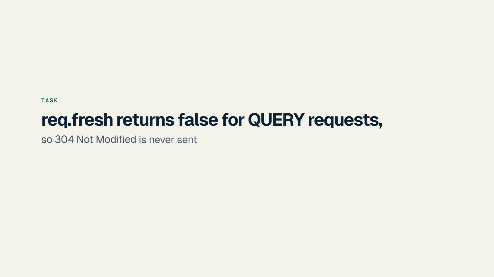

<div align="center">

# FixMap

Tell AI coding tools which files to check first.

Describe what is broken. FixMap checks the project and gives tools like Codex, Claude Code, and Cursor a short list of files to open, tests to run, and other code to review. It includes reasons and says when it is unsure—without an account, API key, or model call.

[](https://github.com/aryamthecodebreaker/FixMap/actions/workflows/ci.yml)
[](https://www.npmjs.com/package/@aryam/fixmap)
[](https://github.com/aryamthecodebreaker/FixMap/releases/latest)
[](https://github.com/marketplace/actions/fixmap)
[](LICENSE)

[Website](https://usefixmap.vercel.app) · [Use cases](https://usefixmap.vercel.app/use-cases) · [Live demo](https://usefixmap.vercel.app/demo) · [Documentation](https://usefixmap.vercel.app/docs) · [Evidence](https://usefixmap.vercel.app/evidence) · [Changelog](CHANGELOG.md)

</div>

[](https://usefixmap.vercel.app/fixmap-launch.mp4)

<p align="center"><a href="https://usefixmap.vercel.app/fixmap-launch.mp4">Watch the 31-second FixMap workflow video with sound</a></p>

Try a task in the [homepage sample](https://usefixmap.vercel.app). It runs the real FixMap Plan engine in the tab against the bundled `sample-api` project. It does not inspect your repository or upload the task text. Use [Get started](https://usefixmap.vercel.app/get-started) for your own repository, or open the [full browser demo](https://usefixmap.vercel.app/demo) for advanced workflows.


## Install

Requires Node.js 20.11 or newer.

```bash
npm install --global @aryam/fixmap@latest
fixmap plan --issue https://github.com/chalk/chalk/issues/624
```

For a one-off trial:

```bash
npx -y @aryam/fixmap@latest plan --issue https://github.com/chalk/chalk/issues/624
```

Install a discoverable `/fixmap` command for Claude Code, Cursor, GitHub Copilot, and Agent Skills:

```bash
fixmap setup --agent all
```

Type `/fixmap` with no task to see the full feature menu, or run `fixmap features` in a terminal. Use `fixmap setup --agent <name>` to install one integration, and `--force` only after reviewing an existing customized command.

FixMap fetches a public task, infers its repository, scans a temporary isolated checkout, and removes it when the report is complete. Local repository analysis never uploads source.

## Everyday workflow

Save a plan before editing:

```bash
fixmap plan --issue "password reset emails fail" --format json --output plan.json

# Optional local semantic recall alongside structural and BM25 evidence
fixmap plan --issue "keep signed-in users active" --semantic-model C:\models\all-MiniLM-L6-v2

# Attach durable tribal knowledge that relevant future plans will surface
fixmap annotate src/auth/token.ts --note "Do not refactor; external contract" --owner platform-team
```

The plan separates primary context from likely impact: imports, reverse dependents, routed tests, and repeated Git co-change relationships. Impact files are places to inspect, not assumed edits.

Measure BM25, FixMap, and Impact Graph on your own repository's history:

```bash
fixmap benchmark --repo . --last 50
```

Keep the saved plan beside an agent while it edits. Watch emits a new verification only when the working tree changes and recalculates impact around the actual diff:

```bash
fixmap watch --report plan.json --repo . --include-untracked
```

Give an agent the relevant source ranges instead of only file names. Context draws from primary and impact files and stays within an estimated source-token budget:

```bash
fixmap context --issue "password reset emails fail" --budget 10000
```

Export the evidence graph for a pull request, issue, or design note:

```bash
fixmap graph --issue "password reset emails fail" --format mermaid
```

Use compact headings in an agent context window:

```bash
fixmap plan --issue "password reset emails fail" --format agent
```

Ask why an expected path is missing:

```bash
fixmap plan --issue "password reset emails fail" --explain src/auth/token.ts
```

Refine the task and compare the ranking:

```bash
fixmap plan --issue "sendMail throws during password reset" --compare plan.json
```

Verify the completed diff against the saved plan:

```bash
fixmap verify --report plan.json --diff main...HEAD
```

Validate a saved report before another tool consumes it:

```bash
fixmap validate plan.json
```

Ask a citation-backed structural question without reading source or calling a model:

```bash
fixmap ask --report plan.json --question "Which tests should I run?"
```

Build a review-only, dependency-ordered migration plan against an exact identity-graph snapshot:

```bash
fixmap migrate --input migration.json
```

The checked-in [`examples/migration-plan/migration.json`](examples/migration-plan/migration.json) shows the versioned input contract. Migration planning is review-only: FixMap validates and renders the phases but does not execute commands, edit source, or authorize rollout.

Draft documentation from exact, caller-reviewed structural evidence without writing into the repository:

```bash
fixmap reverse-docs --input examples/reverse-documentation/input.json
```

The output separates observations, inferences, unknowns, and provenance. Requested destinations are advisory only; FixMap neither creates nor overwrites them.

Compare architecture at two committed refs without checking either one out:

```bash
fixmap history --repo . --from v0.9.0 --to HEAD
```

The result records both immutable commit IDs and reports added or removed edges, cycle and policy drift, and coupling growth. It reads Git objects directly and leaves HEAD and the worktree untouched.

Import a normalized, versioned external scanner or SBOM evidence bundle:

```bash
fixmap supply-chain --input examples/supply-chain/bundle.json
```

FixMap validates exact tool, database, document, advisory, package, version, and license provenance. It does not fetch advisories, maintain a vulnerability truth corpus, run a scanner, prove exploitability, or authorize remediation.

Map redaction-reviewed runtime evidence to exact repository file identities:

```bash
fixmap runtime --input examples/runtime-evidence/input.json
```

Runtime labels or symbols never establish identity. The output preserves unmapped records and explicitly avoids treating span duration as CPU time, samples as wall-clock time, or correlation as causality.

Run one reviewed, already-declared test command in an isolated local container:

```bash
fixmap sandbox --request sandbox.json --execute-declared-command
```

The request must name an absolute repository path, an already-present digest-pinned image, and an exact command included in `declaredCommands`. The request file cannot self-authorize execution. Network is off unless both the reviewed request enables it and the separate `--allow-sandbox-network` flag is supplied.

Use `--working-tree` for staged and unstaged tracked edits, `--include-untracked` when new files should count as changes, `--exclude` or `.fixmapignore` to focus the map, and `--no-cache` to force a fresh scan. `--semantic-model <dir>` explicitly opts into local hybrid retrieval using a model already on disk. Add `--fail-on warning` to Verify when advisory findings must fail CI. Run `fixmap --help` for the complete command reference.

Map impact across local service repositories with a reviewed workspace config:

```json
{
  "workspaceConfigVersion": 1,
  "workspace": "acme",
  "repositories": [
    { "id": "auth", "path": "../auth-service" },
    { "id": "payments", "path": "../payments-service" },
    {
      "id": "shared-contracts",
      "path": "../auth-service/vendor/contracts",
      "relationship": {
        "kind": "submodule",
        "parentRepository": "auth",
        "path": "vendor/contracts"
      }
    }
  ]
}
```

Repository paths are resolved relative to the config file. The command accepts 1–32 local checkouts, scans at most four concurrently, never executes repository code, and resolves Node, Python, and Maven package/version identities from manifests and imports:

```bash
fixmap workspace --config .fixmap/workspace.json --seed auth --format json
```

Run the checked-in two-service example with `fixmap workspace --config examples/cross-repo-workspace/workspace.json --seed auth`.

Repeat `--seed` to trace downstream provider-to-consumer impact from multiple repositories. Duplicate IDs, duplicate real checkout paths, unknown seeds, remote URLs, invalid submodule parents, and ambiguous package providers are rejected or diagnosed instead of silently merged.

Plan a product change from code surfaces you choose explicitly:

```bash
fixmap change-scope \
  --touch src/routes/checkout.ts \
  --touch packages/payments \
  --add db/migrations
```

FixMap follows bounded imports and dependents, then joins existing tests, contracts, ADRs,
review ownership, and architecture policy. A missing `--add` path stays unresolved. FixMap does
not interpret what "checkout" means, call an API or LLM, or require an account.

Persist a reviewed product-to-implementation map without persisting generated conclusions:

```bash
fixmap capability create checkout --name "Checkout" \
  --touch src/routes/checkout.ts --touch packages/payments
fixmap capability checkout
fixmap capability diff checkout v1.4.0..HEAD
fixmap capabilities
```

The versioned `.fixmap/capabilities.json` contains only human-owned names, explicit anchors,
workspace/repository identities, and traversal bounds. Current files are recalculated from the
repository graph. Output uses exact declared, observed, derived, and unresolved counts rather
than an undefinable confidence percentage. Capability diff reads both refs from immutable Git
objects without checking either out, and reports added, removed, modified, and unchanged scope,
contract, decision, test-association, reviewer, and architecture evidence.

## Complete feature catalog

### Inputs and repository mapping

- Accepts a public GitHub issue or pull-request URL, plain task text, a UTF-8 or UTF-16 `--issue-file` (including common BOM-less Windows UTF-16 files), bare piped task text, or explicit stdin through `--issue-file -` / `--issue -`. Very long task text should use a file or stdin because an inline `--issue` can exceed Windows' process command-line limit before FixMap starts.
- Normalizes supported browser and GitHub API issue URLs, including `www`, query strings, and fragments, while rejecting credentials, lookalike hosts, ports, and unsafe encoded paths.
- Scans the current checkout, another local path, a `file://` URL, or an isolated checkout of a public GitHub repository.
- Maps `--diff <spec>`, `--base`/`--head`, or the current `--working-tree`; untracked changes remain opt-in with `--include-untracked`.
- Reuses raw repository scans only when the repository root, commit, status, and binary diff are identical. Task text, `--limit`, and exclusion rules are applied after that scan, so changing them can safely reuse the same cached files while still producing a newly ranked and filtered report; Compare scans the current plan, while Verify validates its supplied report against a fresh or exact-state repository map. `cache-hit` reports reuse and scan age, entries expire after seven days, and `FIXMAP_CACHE_DIR` moves the OS cache. Force a fresh scan with CLI `--no-cache`, MCP `noCache: true`, or Action `no-cache: true`.
- Keeps the current `--issue-file`, `--compare`, `--report`, and `--output` artifacts out of repository ranking, change detection, and cache invalidation. Previously saved FixMap report, verify, and context artifacts are recognized from their content contract—not a guessed filename—and removed from the returned file snapshot, changed-file list, ranking, impact analysis, and context packs with a visible diagnostic. Signature-recognized commands written by `fixmap setup` receive the same treatment, while team-owned content at those paths remains eligible. Because arbitrary prior artifacts must be read before they can be recognized, changing one may still refresh the raw scan cache even though it cannot enter the resulting plan.
- Detects npm, pnpm, Yarn, and Bun projects and reads the scripts declared by each workspace package. When the root is silent it can infer an agreed nested lockfile, while conflicting root declarations produce a diagnostic instead of silently choosing.

### Plan and ranking

- Ranks source, test, configuration, documentation, and other files from path terms, source content, identifiers, quoted fragments (including smart quotes and guillemets), file mentions, and real diff content.
- Uses one deterministic adapter path for JavaScript/TypeScript, Python, Java, Go, Rust, Ruby, PHP, and .NET definitions, imports, test layouts, exact-identifier grounding, fix-site ranking, and impact edges. Go resolves longest-prefix modules and cross-module imports only through literal repository-contained `go.work` membership; Rust resolves literal repository-contained Cargo path dependencies, renamed/inherited workspace aliases, and exact `#[path]` modules; PHP resolves declared symbols plus repository-contained Composer PSR-4/classmap paths; .NET namespace resolution includes symbol-backed literal project/source global usings and remains scoped by repository-contained `ProjectReference` relationships, while unique literal `.sln` membership safely combines multiple referencing test projects. Resolution stays source-based and bounded; dynamic expressions, generated relationships, absolute paths, and repository-escaping paths remain unknown instead of guessed.
- Recognizes JavaScript/TypeScript declaration tests, Go `_test.go`, Python `test_*.py` and `*_test.py`, Rust integration tests, Ruby specs/tests, PHP tests, .NET tests, common test directories, and framework single-file components.
- Expands caller-selected build surfaces with `fixmap change-scope` using stable file identities, explicit touch/add anchors, allowlisted import/dependent edges, mandatory depth/node bounds, and visible omissions. Product words are never converted into anchors.
- Rebuilds persistent human-named capability maps from `.fixmap/capabilities.json`; the store is atomically locked and updated by CLI create/update/remove, while CLI and MCP show/list remain local and deterministic. Generated scope conclusions are schema-invalid store fields.
- Deprioritizes lockfiles, sync-client backups, bundled output, examples, and generated counterparts when maintained source exists, while keeping ordinary modules such as `deep-copy.ts` and tracked first-party `vendor/` source rankable.
- Routes reachable test commands from real package scripts and pairs them with the nearest related test files. Ruby routes RSpec or Minitest only from scoped Gemfile, test-layout, helper, or Rake-task evidence; a bare Gemfile and mixed ambiguous evidence produce no invented command. PHP uses `composer test` only when that script exists, routes project-local `vendor/bin/pest` only from a declared `pestphp/pest` dependency, uses project-local `vendor/bin/phpunit` only when Composer declares that dependency, and otherwise derives scoped `phpunit -c` from an exact PHPUnit config. Pest bootstrap files are configuration, not claimed test coverage. .NET changes route to an explicitly referencing test project when one exists, otherwise to the exact owning project; ambiguous root-level ownership produces no invented project command. It warns when routed JavaScript, Python, Go, or Rust tests are skipped, ignored, conditional, or gated.
- Accepts versioned, source-fingerprinted CI observations through the Core API to distinguish same-revision flakiness, current failures, skipped or quarantined tests, gated execution, insufficient history, and repeatedly clean execution. A declared test route counts as reliably observed only when every related test path clears the conservative history threshold; this remains execution evidence, not proof that a test is correct.
- Selects a bounded CI matrix from explicitly declared jobs and evidence-backed OS, runtime, database, browser, feature-flag, and deployment requirements. Every chosen cell explains what it covers and why; uncovered requirements stay visible, and the deterministic greedy selection does not claim mathematical minimality.
- Produces review-only characterization-test drafts from redaction-reviewed observations. Draft steps cite exact observation and source provenance, separate one-off from repeated multi-environment behavior, and never imply correctness or permission to execute or commit generated tests.
- Maps normalized redaction-reviewed trace/APM spans and profile frames to exact repository/file identities only when explicit repository-relative code locations exist. Unresolved frames remain visible, latency stays distinct from CPU samples, and runtime correlation is never presented as causation.
- Ranks incident regression suspects from bounded deployment timing, exact changed files, post-deployment error locations, mapped runtime evidence, and impact links. Signals remain inspectable observations or inferences, repeated exporter records cannot multiply a rule’s weight, and every result explicitly says causality is not established.
- Exposes one versioned, deep-frozen local editor protocol for synchronized plan, file-impact, test, risk, decision, policy, and annotation views. Every response carries the source snapshot fingerprint; the protocol requires no network or source upload and is documented for VS Code, JetBrains, Neovim, and other adapters.
- Answers structural questions from a bounded report-evidence pack without requiring a model. Optional model providers must cite supplied evidence IDs and list unknowns; invalid answers fall back deterministically, remote evidence sharing requires explicit consent, and generated claims remain unverified.
- Drafts reverse module and architecture documentation from exact file, graph, and authored-decision evidence while separating observation, inference, and unknowns. Drafts are review-only, never write to the repository, and refuse to present an existing document path as an overwrite target.
- Provides same-tenant, default-deny enterprise authorization primitives, SHA-256-linked audit envelopes, and legal-hold-aware retention decisions. Core never claims to authenticate the caller, audit chains still require an external trusted anchor, and retention never deletes automatically.
- Includes pinned, non-root self-hosted MCP and standalone product-UI container targets with health checks and explicit cache/workspace mounts. The image is designed for orchestrator-enforced zero egress; it does not misrepresent the UI as a hosted scanner, and release evidence still requires Docker-capable clean-runtime tests and image scanning.
- Reports six bounded risk areas: authentication, billing, automation, data, public API, and dependencies.
- Explains task grounding, ranking shape, unresolved or partially matched identifiers, exclusions, scan limits, unread content, skipped submodules and linked filesystem paths, empty diffs, and Git failures.
- Supports a strict decimal `--limit` from 1 to 20, repeatable `--exclude`, and ordered `.fixmapignore` patterns with negation. Root-leading patterns are repository-relative, pasted absolute paths inside the repository are normalized, and patterns that match nothing produce a warning. Limits change only how many rows are shown, never confidence or ranking-shape analysis.

### Impact Graph and repository benchmark

- Builds a separate likely-impact view from direct imports, reverse dependents, routed tests, and Git files that repeatedly changed with a primary ranked file.
- Reads at most 1,000 non-merge commits, excludes commits touching more than 30 files, requires at least two co-occurrences, and marks shallow or unavailable history instead of inventing evidence.
- Recalculates impact around files actually changed during Verify and identifies high-evidence dependents outside the original plan as inspection notes, never mandatory edits.
- `fixmap benchmark --repo . --last 50` evaluates BM25-over-code, ordinary FixMap context, and Impact Graph against historical parent snapshots. Every case's history stops before its target change, all arms see one scanned corpus, generated twins are not scored as primary answers, and mentioned/unmentioned tasks are reported separately.
- `fixmap watch --report plan.json --repo .` monitors a local working tree, re-runs Verify, and recalculates impact only when edits change. It never executes repository code; `--format json` produces one JSON object per update.
- Benchmark Markdown and versioned JSON include Wilson intervals, excluded-case counts, secondary-file recall, safeguards, and raw per-case outcomes. Historical commit messages are a repository-specific backtest, never proof of agent savings.

### Cross-repository workspace impact

- `fixmap workspace --config .fixmap/workspace.json` composes 1–32 local checkouts into one versioned identity graph without installing dependencies or executing repository code.
- Node `package.json`, Python `pyproject.toml`, and Maven `pom.xml` manifests contribute package names and versions. Manifest declarations and cross-repository source imports remain separate, inspectable evidence on each dependency.
- `--seed <repository-id>` traverses package providers to downstream consumers and reports distance plus the exact manifest/import paths that justify every link. Repeat the flag for multiple seeds.
- Paths are relative to the config file; canonical real-path checks prevent one checkout from being entered twice through aliases. Submodules require an explicit parent relationship, and duplicate package providers remain unresolved with diagnostics.

### Context packs and graph export

- `fixmap context` selects deterministic line ranges from primary and impact files, labels each snippet as primary or impact, and records its reason, confidence, line range, estimated token cost, source truncation, and omitted-file reason.
- The budget counts source using the stable estimate `ceil(UTF-8 bytes / 4)`; metadata is excluded. This is a reproducible planning estimate, not a tokenizer-specific exact count.
- Context may use FixMap's bounded scanner sample rather than an entire large file. `sourceTruncated` makes that boundary explicit in JSON and Markdown.
- `fixmap graph` exports the same Impact Graph as Mermaid or versioned JSON, preserving imports, imported-by, test-route, and co-change direction and evidence.

### Exclusion pattern syntax

`--exclude` and `.fixmapignore` use repository-relative gitignore-style patterns. `/docs/**` anchors at the repository root, `docs/**` matches the same root directory and nested occurrences, `!docs/keep.md` re-includes a path after an earlier exclusion, and trailing `/` targets a directory. `*`, `?`, and `**` are supported; brace groups such as `{src,test}` are literal text, not alternation. Pass repeated `--exclude` flags or put one pattern per `.fixmapignore` line so commas in literal names stay unambiguous.

Architecture rules live in a reviewed `.fixmap/policy.json` file. Every rule has a stable ID, a reason, and bounded repository-relative patterns:

```json
{
  "architecturePolicyVersion": 1,
  "boundaries": [
    {
      "id": "ui-no-data",
      "from": ["src/ui/**"],
      "deny": ["src/data/**"],
      "reason": "UI code must use the service layer.",
      "severity": "error"
    }
  ],
  "requiredTests": [
    {
      "id": "auth-tests",
      "paths": ["src/auth/**"],
      "tests": ["test/auth/**"],
      "reason": "Authentication changes need regression coverage.",
      "severity": "warning"
    }
  ],
  "requiredReviews": [
    {
      "id": "billing-review",
      "paths": ["src/billing/**"],
      "reviewers": ["payments-team"],
      "reason": "Billing changes need domain review."
    }
  ],
  "contracts": [
    {
      "id": "public-api-compatible",
      "paths": ["openapi.*"],
      "forbidBreaking": true,
      "reason": "Public API removals need a compatibility window.",
      "severity": "error"
    }
  ]
}
```

- Produces Markdown for people, versioned JSON for tools, or `--format agent` for compact `EDIT CANDIDATE`/`INSPECT`/`TEST`/`RISK`/`AVOID`/`UNCERTAINTY` sections; writes any format with `--output`.

### Explain, Compare, Verify, Validate, and Doctor

- **Explain** tells you whether a path ranked, fell below the cutoff, was excluded, resolves through a submodule, or was never scanned—and uses the same task and diff evidence as Plan.
- **Compare** shows files that entered, left, moved, or changed confidence after the task was refined, plus changes in task grounding.
- **Verify** compares a saved JSON plan with a diff or working tree, recalculates impact, and flags generated edits, unmapped changes, an untouched leading file, source changes without tests, newly reached risk areas, and plan/repository mismatches. It fails on errors by default; `--fail-on warning` and the Action's `fail-on: warning` turn advisory findings into an opt-in CI gate.
- **Validate** checks any saved JSON report with the structural compatibility validator shared by Compare, Verify, the Action, and MCP.
- **Doctor** prints the running version and executable path and diagnoses project, global, PATH, and npm-exec version shadows.
- `FIXMAP_PROGRESS` controls remote clone/scan progress, and `FIXMAP_VERBOSE_USAGE` restores full usage text after argument errors.

### Agent and automation interfaces

- `fixmap setup` installs `/fixmap` discovery for Claude Code, Cursor, GitHub Copilot prompt files, and the open Agent Skills layout; the no-argument command lists every FixMap workflow before making changes.
- The MCP server exposes `fixmap_plan`, `fixmap_context`, `fixmap_graph`, `fixmap_workspace`, `fixmap_ask`, `fixmap_migrate`, `fixmap_reverse_docs`, `fixmap_history`, `fixmap_supply_chain`, `fixmap_runtime`, `fixmap_explain`, `fixmap_compare`, `fixmap_verify`, and `fixmap_doctor` over local stdio and is published in the official MCP Registry.
- The GitHub Action runs Plan or Verify on pull requests, appends within the job summary's remaining 1 MiB budget, bounds its report output and comment, and creates or updates one FixMap comment instead of posting duplicates.
- The Action accepts explicit task input or pull-request context, uses the same report validator as the CLI and MCP server, and fails clearly when a requested diff cannot be resolved.
- The homepage task mapper runs real Plan logic against the bundled `sample-api` repository and preserves the engine's uncertainty state instead of inventing fallback results.
- The full browser demo runs the real core Plan, Explain, Compare, and Verify logic against the same sample repository without uploading the task.

### TypeScript library

- `@aryam/fixmap-core` exposes repository scanning, exclusion resolution, structural/BM25/optional local-semantic ranking, persistent model-isolated vector caching, Context Pack and Impact Graph construction, task grounding, language/import analysis, test/risk routing, report validation, and Markdown/JSON/agent/Mermaid rendering.
- Its v0.10 graph primitives assign hierarchical identities from repository through service, package, module, file, symbol, contract, runtime component, and deployment. Equivalence is always an explicit edge, and exact scanner fingerprints drive versioned stale-node/stale-edge invalidation across derived relationships.
- `buildWorkspaceMap` composes already-scanned Node, Python, and Maven repositories into one identity graph with package versions, submodule provenance, manifest/import evidence, and optional explicitly reviewed service/catalog/runtime identities and relationships.
- Contract Guardian inventories OpenAPI, AsyncAPI, GraphQL, Protobuf, JSON Schema, and SQL migration surfaces, compares exact before/after fingerprints, labels compatible/breaking/unknown deltas, and fails closed when a source is incomplete or cannot be parsed safely.
- Its public API also exposes Explain, Compare, and Verify builders and result types, so another tool can compose the same workflow without shelling out to the CLI.
- `fixmap annotate` writes a versioned `.fixmap/annotations.json` with stable content identities, file/symbol/service/contract scopes, optional owner and expiry, and rename/missing-target checks. Relevant notes retain the store fingerprint in Markdown, JSON, and compact agent reports.
- `.fixmap/policy.json` defines bounded, repository-owned dependency boundaries, required test changes, reviewer routing, and breaking-contract rules. Plan and Verify use the same evaluator and retain the exact policy fingerprint; Core can also compare deterministic architecture snapshots for new edges, cyclic components, boundary violations, and coupling growth.
- Historical Core APIs resolve refs to immutable commits and compare exact Git-blob architecture snapshots without checking out a branch, moving `HEAD`, or writing into the worktree.
- The opt-in local sensitive-data evidence provider emits provenance-marked credential/token/PII/payment indicators and structural proximity to logging/network/storage/analytics sinks. It never copies detected values or snippets and explicitly labels every result as low-confidence, incomplete evidence rather than a taint or security proof.
- Supply-chain evidence uses a versioned normalization boundary for externally generated package, vulnerability, outdated-version, and license-policy findings. Tool/database versions, document SHA-256, confidence, advisory and fix data remain attached; FixMap does not maintain a CVE corpus or silently decide that a dependency or license is safe.
- Concurrent change intents can be checked for edit/edit, directional edit/impact, shared-contract, and stale-graph conflicts using stable graph identities. Matching labels do not conflict unless an explicit reviewed alias/equivalence relationship says the identities are the same, and unrelated work is never locked.
- Migration plans are built against an exact identity-graph version and require dependency ordering, compatibility strategy and exit criteria, verification commands, rollback triggers/actions, and per-phase edit/impact/contract blast radius. Cycles and undeclared parallel overlap fail closed.
- Alternative plans can be compared only on the same graph fingerprint across unique blast radius, contract compatibility, policy findings, declared test coverage, reversibility, and uncertainty. FixMap exposes axis evidence and non-dominated choices instead of inventing a universal winner score.
- Versioned outcome records keep predicted paths, actual edits, command results, and separately sourced task assessment distinct. Calibration is visible and records can be removed; no API silently changes global ranking weights or treats a passing test as proof that the task succeeded.
- A versioned change dossier links request, assumptions and their evidence status, plan/graph fingerprints, decisions, nullable diff state, command outcomes, runtime observations/inferences, reviews, and optional release identifiers. It remains valid before release and detects content that no longer matches its stable fingerprint.
- Review routing combines declared CODEOWNERS, active annotation owners, architecture policy, and bounded Git author history with exact provenance and confidence. Historical authorship stays low-confidence and every suggestion explicitly says current availability or employment was not inferred.
- The opt-in Node sandbox runs only an exact declared command after explicit consent inside an already-present digest-pinned Docker image. Pulls are disabled, network is off by default, source/root are read-only, privileges and resources are constrained, host environment variables are not passed into the container, and results preserve pass/fail/timeout/crash/unavailable provenance.
- ADR/rationale ingestion preserves the repository author’s Context, Decision, and Consequences text with its exact file fingerprint. Plans attach explicit scopes and verified literal path mentions; malformed, incomplete, or stale-target records become diagnostics rather than invented intent.
- Verify narrates why a diff needs attention and labels every sentence as observation or inference; JSON keeps the exact changed-file, relationship, test, risk-rule, annotation, ADR, or architecture-policy evidence behind it.
- The `@aryam/fixmap-core/browser` entry runs the filesystem-free report, comparison, explanation, verification, workspace/identity-graph, and rendering logic in a browser bundle.

### Trust, compatibility, and evidence

- Default core analysis is deterministic and local-first: no account, API key, hosted model, source upload, dependency install, repository script, test execution, or Git hook. Semantic mode is an explicit opt-in: it accepts only a pre-existing local model directory, forces local-files-only loading, records the complete model-bundle hash and runtime, and never uploads source. FixMap intentionally does not bundle the optional Transformers.js runtime; hosts must install and audit a compatible runtime separately.
- Public-repository analysis uses a temporary shallow checkout with credentials, inherited Git config, hooks, LFS smudging, symlinks, and submodule traversal disabled.
- `reportVersion: 1` defines the JSON compatibility boundary; additive fields are allowed, legacy unmarked reports remain accepted, and unsupported versions fail with an actionable message.
- Checked-in self, external, held-out, adversarial, and performance records power the evidence page; CI checks empty cohorts, confidence gates, generated-asset drift, Action bundle drift, and the 1,000-file benchmark.
- The documentation site includes the live demo, install paths, evidence with misses, release changelog, responsive navigation, keyboard focus, AA contrast, and a persistent system-aware light/dark theme.

## What the report contains

- Ranked context files with scores, confidence, and evidence.
- Likely impact files with relationship-specific evidence, confidence, history coverage, and inspection order.
- Test routes that correspond to commands the repository actually declares.
- Six bounded risk areas: authentication, billing, automation, data, public API, and dependencies.
- Diagnostics for uncertainty, unread content, scan boundaries, excluded matches, and unresolved diffs.
- A grounded next action that avoids generated counterparts when maintained source exists.

FixMap is deterministic. It narrows investigation; it does not prove that a ranking or change is correct.

## MCP server

Expose Plan, Context, Graph, Explain, Compare, Verify, and Doctor over local stdio:

```bash
fixmap mcp
```

Example client configuration:

```json
{
  "mcpServers": {
    "fixmap": {
      "command": "fixmap",
      "args": ["mcp"]
    }
  }
}
```

See the [MCP setup guide](https://usefixmap.vercel.app/get-started#mcp) for client-specific instructions.

## GitHub Action

```yaml
name: FixMap
on: pull_request

permissions:
  contents: read
  issues: write
  pull-requests: write

jobs:
  fixmap:
    runs-on: ubuntu-latest
    steps:
      - uses: actions/checkout@v7
        with:
          fetch-depth: 0
      - uses: aryamthecodebreaker/FixMap@v0.9.0
        with:
          github-token: ${{ secrets.GITHUB_TOKEN }}
```

The Action writes a bounded report to the job summary and maintains one pull-request comment. If GitHub's limits require truncation, the notice points to a local `--output` plus artifact upload for the complete report. Set `no-cache: true` when a workflow must bypass the exact-state scan cache, or `fail-on: warning` when advisory Verify findings must fail the job. Its checked-in bundle and metadata are release-gated.

## JSON compatibility

New plans include `"reportVersion": 1`. Within a report version, fields may be added, but existing fields are not removed or retyped; consumers should ignore unknown fields. Breaking output changes require a new report version. Compare and Verify continue to accept legacy plans without a marker and reject unsupported marker values.

## Evidence

The [evidence page](https://usefixmap.vercel.app/evidence) is generated from the checked-in held-out, regression, baseline, performance, and adversarial records. It publishes misses and confidence intervals alongside hits. CI rejects empty evaluation files, stale rendered artifacts, adversarial regressions, Action bundle drift, and benchmark drift.

## Safety boundary

FixMap reads and ranks. It does not install dependencies, run repository scripts, execute tests, invoke git hooks, upload local source, or call a hosted model. Remote clones disable credential helpers, inherited git configuration, hooks, submodules, symlinks, and LFS smudging.

See [SECURITY.md](SECURITY.md) for the trust model and reporting process.

## Develop locally

```bash
npm ci
npm run ci
npm run stress:v0.10
```

The v0.10 stress gate runs concurrent cold analyses against one cache, exact-state warm reuse, corrupt-index recovery, saved-report isolation, outside-link containment, and raw MCP initialization/parse-error checks. It is bounded and runs inside temporary directories; it supplements rather than replaces the full unit, cross-platform CI, evaluation, packaging, and production-smoke matrix. The workspace contains the deterministic core, CLI/MCP server, GitHub Action, Next.js website, benchmarks, examples, and release scripts. Start with [CONTRIBUTING.md](CONTRIBUTING.md); architecture and full usage details live in the [documentation site](https://usefixmap.vercel.app/docs).

## Releases

Release notes live in [CHANGELOG.md](CHANGELOG.md) and on the generated [website changelog](https://usefixmap.vercel.app/changelog). The publish workflow verifies internal versions, npm packages, MCP Registry metadata, Action metadata and bundle, the GitHub release, and a clean installed CLI before a release is complete.

## License

[MIT](LICENSE)
